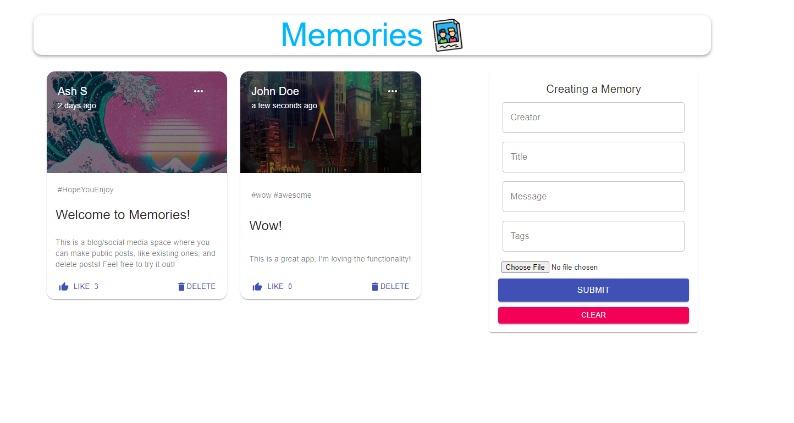

# Making Memories Blog

A social media app that allows users to create, edit, like, and delete blog posts. Built using the MERN (MongoDB, Express, React/Redux, Node) stack.

You can explore a deployed version of this project at: https://making-memories.netlify.app
